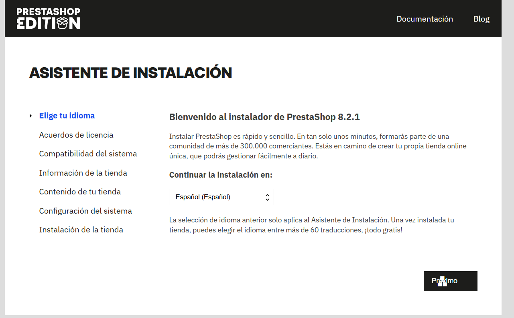
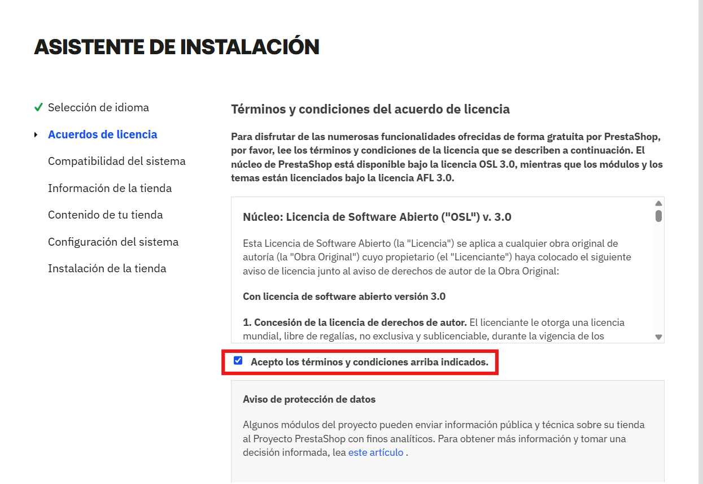
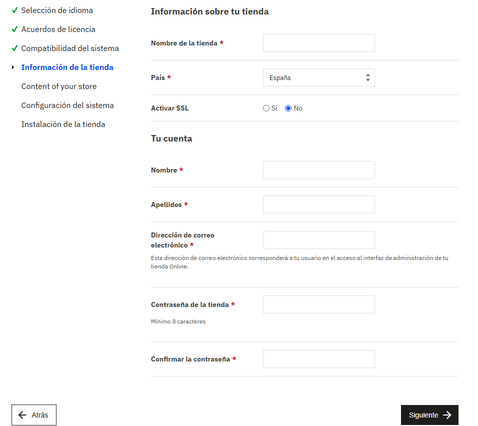
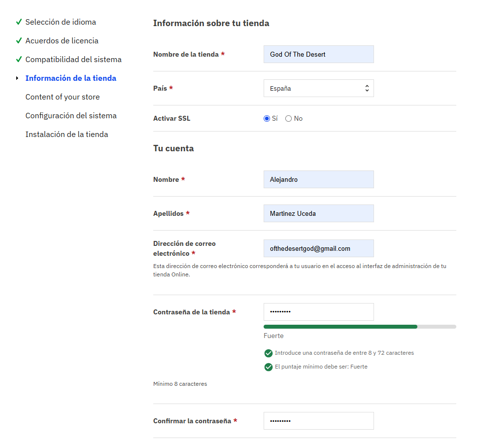
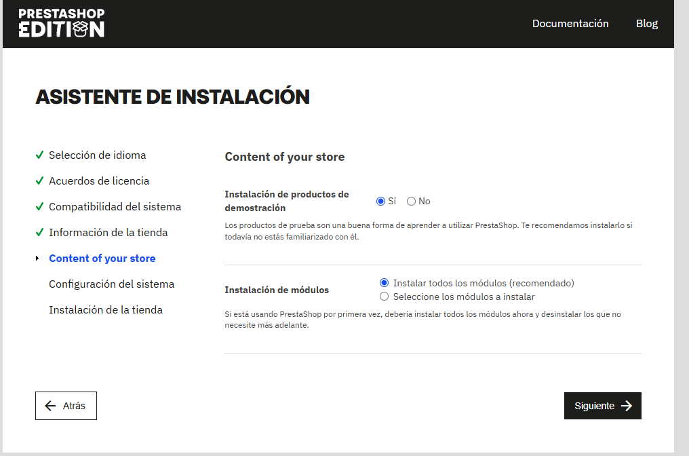
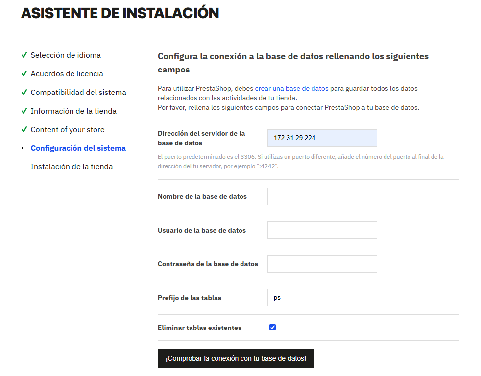

# PRESTASHOP A 3 NIVELES
Este repositorio sirve para la creación de un prestashop a 3 niveles (BACK END - FRONT END - LOAD BALANCER), solo deberas de ejecutar los scripts y seguir los pasos que estan a continuación.
```
├── README.md
├── conf
│   ├── load-balancer.conf
│   ├── 000-default.conf
│   └── .htaccess
└── scripts
    ├── .env
    ├── setup_load_balancer.sh
    ├── install_lamp_frontend.sh
    ├── install_lamp_backend.sh
    ├── setup_letsencrypt_https.sh
    ├── deploy_prestashop.sh
    ├── install_nfs_client.sh
    └── install_nfs_server.sh
```
## VARIABLES
Para comenzar deberemos de rellenar las variables del fichero **.env-example** y renombrabrlo a **.env**.
````bash
#Variables para el certificado de LetsEncript

LE_EMAIL= #(email para el certificado)
LE_DOMAIN= #(Dominio de la pagina)

#Variables para PRESTASHOP

PRESTASHOP_DB_NAME= #(Nombre base de datos)
PRESTASHOP_DB_USER= #(Usuario base de datos)
PRESTASHOP_DB_PASSWORD= #(Contraseña base de datos)
IP_FRONTEND_1=  #(IP privada del front end 1)
IP_FRONTEND_2= #(IP privada del front end 2)
FRONTEND_NETWORK= #(Rango de ip de nuestra red de frontends)
NFS_SERVER_IP= #(IP privada nfs server)
PHP_INI= #(direccion de nuestro php.ini de apache)
````
## BACKEND
Una vez tenemos a disposición nuestros servidores con el **SO instalado** y en .env terminado. Comenzaremos con el servidor de base de datos, clonaremos el repsoitorio en la terminal, el cual le daremos permiso de ejecución al script install_lamp_backend.sh entrando en el directorio y utilizando:

```bash
chmod +x install_lamp_backend.sh
```
Una vez dado permisos de ejecución, ejecutaremos el **script**.

```bash
sudo ./install_lamp_backend.sh
```
## NFS
Tras terminar el proceso de instalación de install lamp del Back End ya tendremos automatizado la creación del servidor base de datos con su base de datos creada y un usuario con permisos para poder entrar desde cualquier nodo. 

Acto seguido pasaremos al servidor **NFS** para la instalación de su setup server. 

Tras la clonación del repositorio en el nuevo servidor en este caso el servidor **NFS**, daremos permiso de ejecución al script setup_nfs_server.sh una vez dentro de su directorio y ejecutandolo:

```bash
chmod +x setup_nfs_server.sh
```
Una vez dado permisos de ejecución, ejecutaremos el **script**.

```bash
sudo ./setup_nfs_server.sh
```
## FRONT ENDS
Ahora nos dirigimos a los servidores front end donde llevaremos a cabo los mismos pasos para los dos servidores. 

Tras la clonación del repositorio en los servidores **FRONT END** , daremos permisos de ejecución a los scripts install_lamp_frontend.sh y setup_nfs_client.sh una vez dentro de su directorio y ejecutandolo:

```bash
chmod +x install_lamp_frontend.sh
chmod +x setup_nfs_client.sh
```
Una vez dado permisos de ejecución, ejecutaremos el **script**.

```bash
sudo ./install_lamp_frontend.sh
sudo ./setup_nfs_client.sh
```
Tras haber ejecutado dichos scripts en los frontend ya tendremos **instalado PHP, Apache y la replica de datos entre el servidor front end y el servidor NFS**. 

Ahora instalaremos prestashop en el **front end 1** que dicha IP has debido de meter en el .env en la variable **IP_FRONTEND_1**. En este al ya tener el repositorio no hara falta copiarlo, solo darle permisos de ejecución y ejecutarlo:

```bash
chmod +x deploy_prestashop.sh
```
Una vez dado permisos de ejecución, ejecutaremos el **script**.

```bash
sudo ./deploy_prestashop.sh
```

Al terminar la ejecución ya tendriamos el isntalador de prestashop en **/var/www/html/**.

## LOAD BALANCER
Para terminar con la instalaciòn de los 5 servidores nos dirigimos al servidor de balanceo en el cual el primer paso es **clonar el repositorio**.

Tras la clonación del repositorio en el nuevo servidor en este caso el servidor **LOAD BALANCER**, daremos permiso de ejecución al script setup_loadbalancer.sh y a setup_letsencrypt_certificate.sh una vez dentro de su directorio y ejecutandolo:

```bash
chmod +x setup_loadbalancer.sh 
chmod +x setup_letsencrypt_certificate.sh
```
Una vez dado permisos de ejecución, ejecutaremos el **script**.

```bash
sudo ./setup_loadbalancer.sh 
```
Tras la ejecución del script **setup_loadbalancer.sh** deberemos de registrar el dominio con la **IP pública** de nuestro servidor **load balancer** como por ejemplo en [NO-IP](https://my.noip.com/) . 


Si nos cambia el nombre de dominio que teniamos pensado al principio deberemos de modificar el **.env** que hemos modificado al principio.

Una vez registrado ejecutaremos el script que nos falta:
```bash
sudo ./setup_letsencrypt_certificate.sh
```
---
# INSTALACIÓN DE PRESTASHOP
Tras haber finalizado la instalación de todas las dependencias de los servidores y descargado el instalador de Prestashop 8.2.1, nos dirigimos a nuestro navegador y ponemos el **nombre de nuestro dominio**, dicho dominio registrado anteriormente en [NO-IP](https://my.noip.com/) en el apartado nombre de host, lo puedes mirar en la anterior imagen.

Una vez tras introducirnos en el dominio nos aparecera una pantalla de carga de prestashop la cual estaria instalando el instalador, cuando esta acabe nos saldra el **asistente de instalación** el cual personalizaremos.

## 1
Para comenzar la personalización nos pedira el idioma de instalación, en nuestro caso el Español.



## 2
Después de elegir el idioma deberemos de aceptar los términos y condiciones, ya que si no lo hacemos no nos dejara continuar con la página.



## 3
En este paso elegiremos el **nombre** de nuestra tienda, **país**, **Activar SSL o no** y nuestra cuenta de **back office** para administrar la tienda.



En nuestro caso:

**Información de su tienda**
-       Nombre de la tienda: God Of The Desert
-        País: España
-       Activar SSL: Sí (ya que tenemos el certificado originado por certbot)

**Tu cuenta**
-       Nombre: (Nombre del usuario)
-       Apellidos: (Apellidos del usuario)
-       Correo: (Correo del usuario)
-       Contraseña: (Contraseña del usuario)




## 4
Una vez terminado el paso anterior nos daran a elegir si queremos productos de demostración el cual nosotros diremos que sí



## 5
Este paso es muy importante ya que deberemos de conectar la página web a nuestra base de datos a través de su IP privada, nombre de base de datos, usuario y su contraseña:

-       Dirección del sevidor de la base de datos: 172.31.29.224
-       Nombre de la base de datos: (PRESTASHOP_DB_NAME en el .env)
-       Usuario de la base de datos: (PRESTASHOP_DB_USER en el .env)
-       Contraseña de la base de datos: (PRESTASHOP_DB_PASSWORD en el .env)
-       Prefijo de las tablas: (por defecto ps_)
-        Eliminar tablas existentes: Sí

## 6 
Una vez nos salga esta pantalla tras haber finalizado el asistente instalación


Deberemos de borrar la carpeta install de los archivos.
```bash
sudo rm -rf /var/www/html/install
```
Tras borrar la carpeta install, nos introducimos en el back office y ponemos nuestra tienda visible y ya tendriamos nuestra página en funcionamiento utilizando nuestros 5 servidores.


