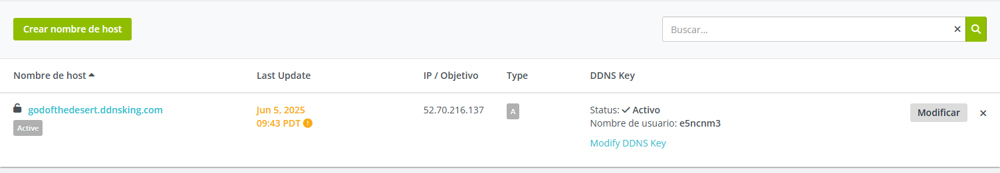

# Prestashop a 3 niveles
Este repositorio sirve para la creación de un prestashop a 3 niveles (BACK END - FRONT END - LOAD BALANCER), solo deberas de ejecutar los scripts y seguir los pasos que estan a continuación.
## VARIABLES
Para comenzar deberemos de rellenar las variables del fichero **.env-example** y renombrabrlo a **.env**.
````bash
#Variables para el certificado de LetsEncript

LE_EMAIL= #(email para el certificado)
LE_DOMAIN= #(Dominio de la pagina)

#Variables para PRESTASHOP

PRESTASHOP_DB_NAME= #(Nombre base de datos)
PRESTASHOP_DB_USER= #(Usuario base de datos)
PRESTASHOP_DB_PASSWORD= #(Contraseña base de datos)
IP_FRONTEND_1=  #(IP privada del front end 1)
IP_FRONTEND_2= #(IP privada del front end 2)
FRONTEND_NETWORK= #(Rango de ip de nuestra red de frontends)
NFS_SERVER_IP= #(IP privada nfs server)
PHP_INI= #(direccion de nuestro php.ini de apache)
````
## BACKEND
Una vez tenemos a disposición nuestros servidores con el **SO instalado** y en .env terminado. Comenzaremos con el servidor de base de datos, clonaremos el repsoitorio en la terminal, el cual le daremos permiso de ejecución al script install_lamp_backend.sh entrando en el directorio y utilizando:

```bash
chmod +x install_lamp_backend.sh
```
Una vez dado permisos de ejecución, ejecutaremos el **script**.

```bash
sudo ./install_lamp_backend.sh
```
## NFS
Tras terminar el proceso de instalación de install lamp del Back End ya tendremos automatizado la creación del servidor base de datos con su base de datos creada y un usuario con permisos para poder entrar desde cualquier nodo. 

Acto seguido pasaremos al servidor **NFS** para la instalación de su setup server. 

Tras la clonación del repositorio en el nuevo servidor en este caso el servidor **NFS**, daremos permiso de ejecución al script setup_nfs_server.sh una vez dentro de su directorio y ejecutandolo:

```bash
chmod +x setup_nfs_server.sh
```
Una vez dado permisos de ejecución, ejecutaremos el **script**.

```bash
sudo ./setup_nfs_server.sh
```
## FRONT ENDS
Ahora nos dirigimos a los servidores front end donde llevaremos a cabo los mismos pasos para los dos servidores. 

Tras la clonación del repositorio en los servidores **FRONT END** , daremos permisos de ejecución a los scripts install_lamp_frontend.sh y setup_nfs_client.sh una vez dentro de su directorio y ejecutandolo:

```bash
chmod +x install_lamp_frontend.sh
chmod +x setup_nfs_client.sh
```
Una vez dado permisos de ejecución, ejecutaremos el **script**.

```bash
sudo ./install_lamp_frontend.sh
sudo ./setup_nfs_client.sh
```
Tras haber ejecutado dichos scripts en los frontend ya tendremos **instalado PHP, Apache y la replica de datos entre el servidor front end y el servidor NFS**. 

Ahora instalaremos prestashop en el **front end 1** que dicha IP has debido de meter en el .env en la variable **IP_FRONTEND_1**. En este al ya tener el repositorio no hara falta copiarlo, solo darle permisos de ejecución y ejecutarlo:

```bash
chmod +x deploy_prestashop.sh
```
Una vez dado permisos de ejecución, ejecutaremos el **script**.

```bash
sudo ./deploy_prestashop.sh
```

Al terminar la ejecución ya tendriamos el isntalador de prestashop en **/var/www/html/**.

## LOAD BALANCER
Para terminar con la instalaciòn de los 5 servidores nos dirigimos al servidor de balanceo en el cual el primer paso es **clonar el repositorio**.

Tras la clonación del repositorio en el nuevo servidor en este caso el servidor **LOAD BALANCER**, daremos permiso de ejecución al script setup_loadbalancer.sh y a setup_letsencrypt_certificate.sh una vez dentro de su directorio y ejecutandolo:

```bash
chmod +x setup_loadbalancer.sh 
chmod +x setup_letsencrypt_certificate.sh
```
Una vez dado permisos de ejecución, ejecutaremos el **script**.

```bash
sudo ./setup_loadbalancer.sh 
```
Tras la ejecución del script **setup_loadbalancer.sh** deberemos de registrar el dominio con la **IP pública** de nuestro servidor **load balancer** como por ejemplo en [NO-IP](https://my.noip.com/) . 



Si nos cambia el nombre de dominio que teniamos pensado al principio deberemos de modificar el **.env** que hemos modificado al principio.

Una vez registrado ejecutaremos el script que nos falta:
```bash
sudo ./setup_letsencrypt_certificate.sh
```
---


